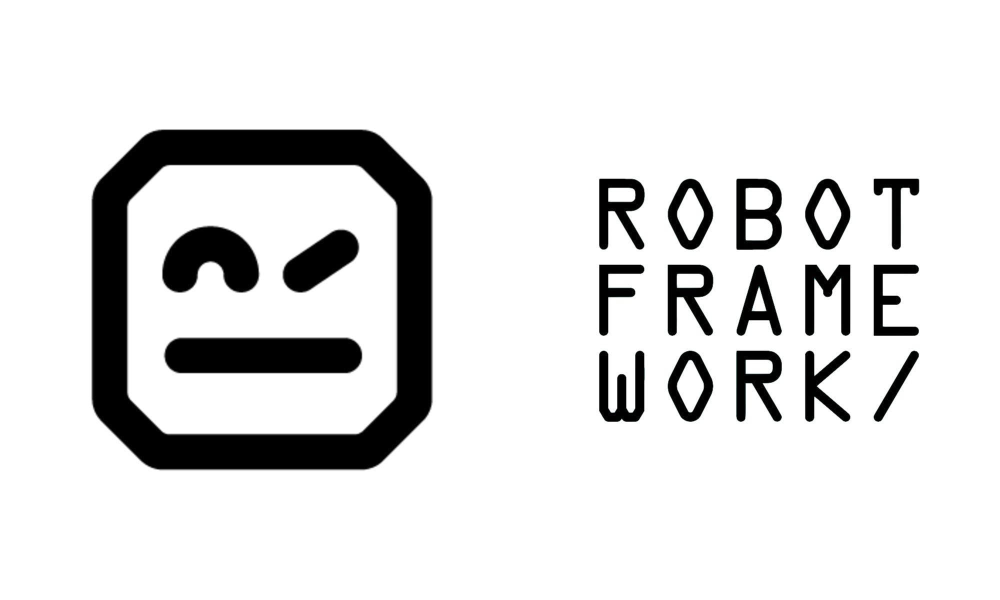

# robot-framework



Estudo de automação web e testes de API utilizando robot framework e Selenium Library, durante a 2ª edição do robo week - disponibilizado pelo QA Ninja e o Fernando Papito.

## Setup

Utilizei o pipenv para criar um ambiente virtual do Python

```console
pipenv install
```

## Instalação

É necessário instalar o *robot framework* e o *selenium library*

```console
pipenv install robotframework
```

```console
pipenv install robotframework-seleniumlibrary
```

Os testes de API serão feitos via requests, utilizando a *robot framework requests library*

```console
pipenv install robotframework-requests
```

Para checar que foi tudo instalado com sucesso

```console
pipenv graph
```

## Execução dos testes

```console
pipenv run robot nome-do-arquivo.robot
```

## Autor

[Gustavo Dias A.](https://www.linkedin.com/in/gustavo-dias-alexandre-543568157/)
